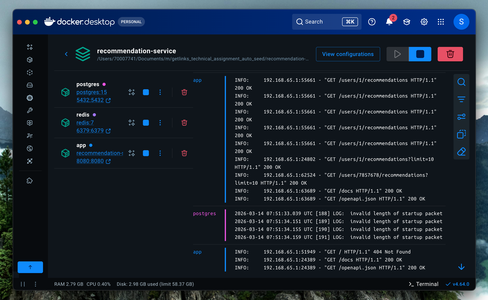
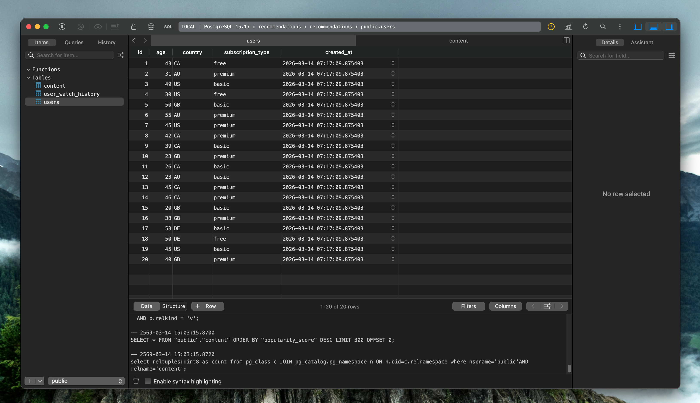
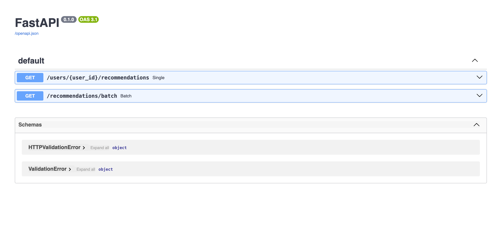
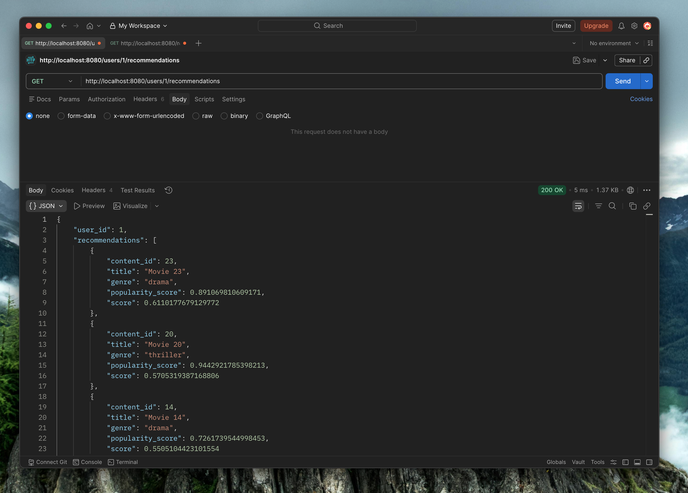

# Recommendation Service

A simple backend service that generates personalized content recommendations for users.

The system demonstrates backend architecture design, caching strategy, database query optimization, and concurrent processing.

---

# Architecture

Client  
│  
▼  
FastAPI Application  
│  
├── Recommendation Service  
│  
├── PostgreSQL (User, Content, Watch History)  
│  
└── Redis Cache (Recommendation Cache)

---

## Project Structure

recommendation-service
│
├── app
│   ├── main.py                # FastAPI entry point
│   ├── recommendation_service.py
│   ├── database.py
│   └── redis_client.py
│
├── init
│   ├── 01_schema.sql
│   └── 02_seed.sql
│
├── docker-compose.yml
├── Dockerfile
├── k6_recommendation_test.js
└── README.md

---

# System Flow

1. Client requests recommendations for a user
2. API checks Redis cache
3. If cache hit → return cached recommendations
4. If cache miss:
   - Query user watch history
   - Analyze genre preference
   - Fetch candidate content
   - Calculate recommendation score
5. Store result in Redis cache
6. Return response to client

---

# Recommendation Algorithm

The recommendation score is calculated based on multiple factors:

| Factor | Weight |
|------|------|
| Content popularity | 40% |
| User genre preference | 35% |
| Content recency | 15% |
| Exploration randomness | 10% |

Final score formula:

score =
popularity * 0.4 +
genre_preference * 0.35 +
recency * 0.15 +
random_noise

---

# Caching Strategy

Redis is used to cache recommendations per user.

Cache key format:

rec:user:{user_id}:limit:{limit}

Cache TTL:

600 seconds (10 minutes)

Benefits:

- reduces database load
- improves response latency
- supports high traffic

---

# API Endpoints

### Get Recommendations

GET /users/{user_id}/recommendations

Example:

/users/1/recommendations?limit=10

Response:

{
    "user_id": 1,
    "recommendations": [
        {
            "content_id": 10,
            "title": "Movie 10",
            "genre": "action",
            "score": 0.87
        }
    ]
}

---

### Batch Recommendation Processing

GET /recommendations/batch?page=1&limit=20

The system processes multiple users concurrently using a thread pool.

---

# Database Schema

Tables:

- users
- content
- user_watch_history

Relationships:

users
│
└── user_watch_history
│
content

---

# Running the System

Start all services:

docker compose up --build

The system will automatically:

- create database schema
- seed test data
- start FastAPI server

---

# Testing API

Open Swagger UI:

http://localhost:8080/docs

Example request:

http://localhost:8080/users/1/recommendations

---

# Load Testing

Load testing was performed using k6.

Test scenario:

- Cache Miss: generate recommendations for random users  
- Cache Hit: test Redis caching performance  
- Batch Processing: test concurrent recommendation processing

Run test:

k6 run k6_recommendation_test.js

---

# Tech Stack

- FastAPI (Python)
- PostgreSQL
- Redis
- Docker

---

# Screenshot

- Docker

- Postgres DB

- API Docs

- run API in postman
